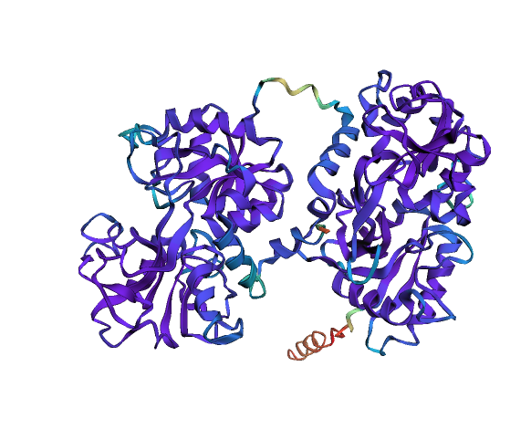
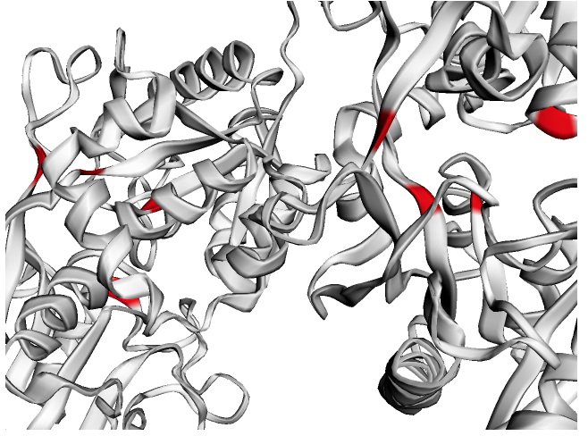
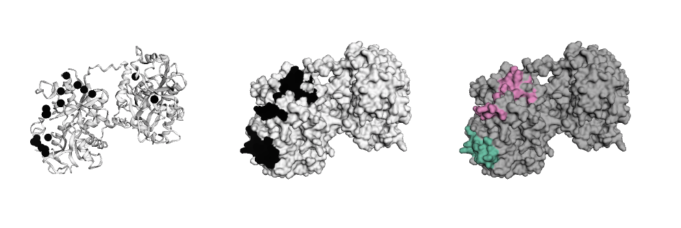

[](https://colab.research.google.com/github/phiweger/faltwerk/blob/master/examples/example_colab.ipynb)

## Faltwerk

`faltwerk` is a library for spatial exploratory data analysis of protein structures. It helps parse them, select items of interest, generate and visualise various protein annotations, and then provide convenient interfaces for downstream tools to run, for example, spatial regression. The most convenient way to run `faltwerk` is in a `jupyter notebook`. This REPL-like execution gives rapid feedback and can help form hypotheses. However, `faltwerk` also integrates nicely into workflows (no point and click required).

<p align="center">
    
</p>

The curious thing about proteins is that they come as linear strings of residues, but then fold up into 3D structures, that represent the functionally active form of the molecule (the thing that "does stuff"). Correspondingly, nature most often selects on structure. However, many analyses (positive selection etc.) require the linear sequence. `faltwerk` bridges this gap (see specific use cases below).

PRs and suggestions welcome! The awesome `Anvio` has a [structure module](https://merenlab.org/2018/09/04/getting-started-with-anvio-structure/), should you be dissatisfied with `faltwerk`. 


### Install

Quick start using the [colab notebook](https://colab.research.google.com/github/phiweger/faltwerk/blob/master/examples/example_colab.ipynb).

```bash
# Dependencies
!pip install faltwerk==0.3
# Install tools from upstream and downstream tasks
!pip install -q pdb-tools altair vega_datasets spreg geopandas
# More dependencies
!mamba install -q -y -c conda-forge -c bioconda foldseek=3.915ef7d hmmer

# For local execution in a jupyter notebook
pip install notebook
jupyter notebook examples/example_local.ipynb
```

It might be necessary to install a `jupyter` extension to visualize the proteins (you notice if they don't render). Please refer to the `py3Dmol` [install documentation](https://pypi.org/project/py3Dmol/) and [repo](https://github.com/3dmol/3Dmol.js) in this case. A typical setup that renders correctly looks like this (Linux and Mac tested):

```bash
# ubuntu 20.04. LTS
# Python 3.10.4

node --version
# v10.19.0

jupyter --version
# IPython          : 8.4.0
# ipykernel        : 6.15.1
# ipywidgets       : not installed
# jupyter_client   : 7.3.4
# jupyter_core     : 4.11.1
# jupyter_server   : not installed
# jupyterlab       : not installed
# nbclient         : 0.6.6
# nbconvert        : 6.5.3
# nbformat         : 5.4.0
# notebook         : 6.4.12
# qtconsole        : not installed
# traitlets        : 5.3.0
```


### Usage

We assume that all protein structures contain a single, and if you are not analysing protein complexes, then you want the structures to only contain a single chain, also. A simple way to clean a query pdb file is through `pdb-tools` (http://www.bonvinlab.org/pdb-tools/). _AlphaFold2_ predictions as generated by _ColabFold_ are ideal.

To get an overview of what you can do with `faltwerk` and to interact with the data and code, we provide a notebook:

```bash
jupyter notebook examples/example_local.ipynb
```

To give an idea of what it looks like to use `faltwerk`:

```python
# Load data
from faltwerk.models import Fold, AlphaFold
# ... (for details see notebook)

fp = 'data/alphafold2/transferrin/test_08df6_unrelaxed_rank_1_model_3.pdb'
model = Fold(fp)

# or
fp = 'data/alphafold2/transferrin/'
af = AlphaFold(fp)
model = af.best

# Visualise pLDDT (how good is AF2 the prediction)
ly = Layout(model).geom_ribbon('plddt', palette='rainbow_r')
```

<p align="center">
    
</p>


```python
# Predict ligand binding sites using the "InteracDome" approach
b = Binding(model, 'representable')
b.predict_binding_(pfam)
binding = b.get_binding('PF00405.16', 'FE')
fe = [i for i, j in enumerate(binding) if j > .5]

ly = Layout(model)
# select
fe_ = ly.select(residues=fe)
# style
ly.geom_ribbon(color='#ffffff')
ly.geom_ribbon(selection=fe_, color='red')
ly.render().show()
```

<p align="center">
    
</p>

```python
# Test for spatial signal in residues that are e. g. mutated or under positive
# natural selection. Here we use residues from Barber et al., Science, 2014
# (https://www.science.org/doi/10.1126/science.1259329) that are under positive
# selection.
original = [153, 253, 382, 434, 435, 436, 439, 558, 574, 575, 576, 591, 592, 593, 614, 617, 619, 625]

# -1 bc/ positions from manuscript are 1-based 
barber2014 = [i-1 for i in original]
selection = [1 if i in barber2014 else 0 for i in range(len(model))]

# (1) Spatial autocorrelation, i. e. "hotspots" in selected features, here using
# the Getis-Ord metric.
FDR = 0.05
hotspots = find_hotspots(
    model,
    selection,
    method='getis_ord',
    angstrom=8,
    false_discovery_rate=FDR,
    test_two_sided=False)

# (2) Point density analysis, here using HDBSCAN.
clusters = cluster(model, hotspots, min_cluster_size=5)

# Annotate model
model.annotate_many_({
    'selection': selection,
    'hotspots': hotspots,
    'clusters': clusters})

# Build figure like a layer cake
ly = Layout(model, panel_size=(200, 200), grid=(1, 3), linked=True)

pos = ly.select(residues=barber2014, elements=['CA'], chain='A')

ly.geom_ribbon(color='#ffffff')
ly.geom_sphere(selection=pos, color='black')
ly.geom_surface('hotspots', palette='binary', panel=(0, 1))
ly.geom_surface('clusters', palette='Set2_r', panel=(0, 2))
ly.render().show()
```

<p align="center">
    
</p>

From here, `faltwerk` allows to easily interact with downstream tools like `altair` for visualisation of features or `pysal` for spatial regression (see notebook `example.ipynb`)

```python
df = pd.DataFrame.from_dict(
    flatten(model.annotation, expected_track_length=len(model)))
```


## Use cases

- Annotate solvent access, active centers and more
- Some regions in the amino acid sequence are more conserved than others across species. Which regions in the 3D structure do they correspond to?
- Are there any significant spatial hotspots where residues experience positive selection?
- Do observed mutations cluster in any part of the protein, for example in regions that interface other proteins (protein binding sites) or active sites of the protein?
- A hotspot/ cluster has been identified; which protein features if any can explain this occurance. For example, is the cluster associated with known protein-binding sites?
- What's the spatial relationship between mutations deemed pathogenic and the annotated functional domains of a protein?
