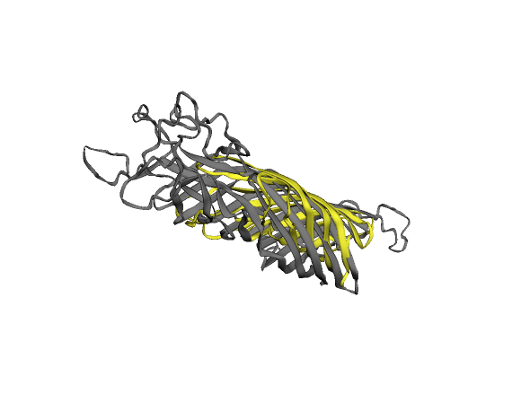
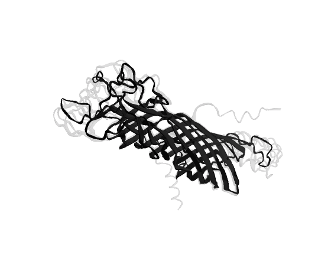
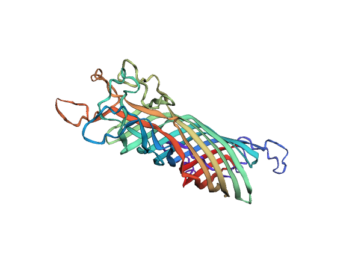
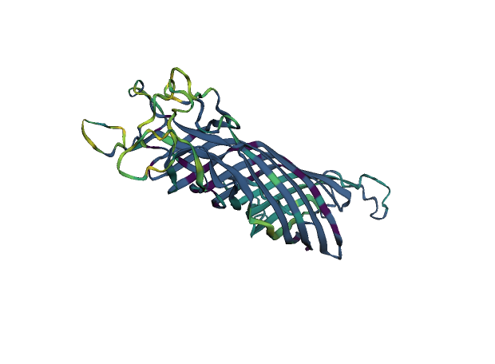
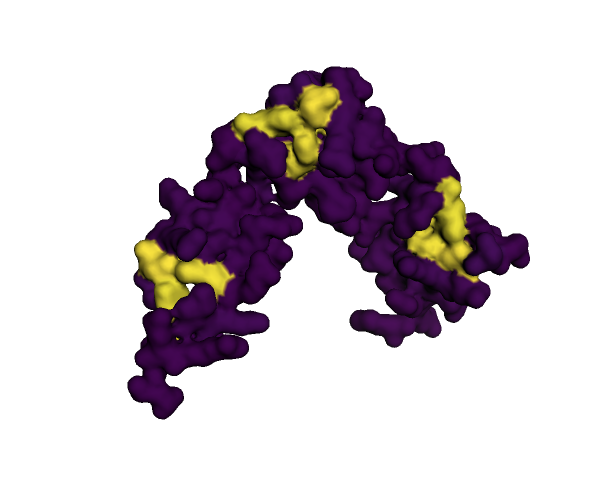

## Foldspace

_Why this library?_ Exploratory analysis of protein structures in a REPL such as `jupyter notebook` and outside of point-and-click tools can be surprisingly annoying. The awesome `Anvio` has a [structure module](https://merenlab.org/2018/09/04/getting-started-with-anvio-structure/), should you be dissatisfied with `foldspace`. However, I wanted a more lightweight tool, which to my knowledge did not exist, so I made one. 

By "exploratory", we mean spatial. The curious thing about proteins is that by design they are a linear string of residues, but then folds up into the functionally active structure. Nature selects on the 3D structure, but we typically analyse the linear sequence (DNA sequencing). `foldspace` really wants to bridge this gap. More specifically, here are some use cases:

- Annotate solvent access, active centers and more.
- Some regions in the amino acid sequence are more conserved than others across species. Which regions in the 3D structure do they correspond to?
- Are there any significant spatial hotspots where residues experience positive selection?
- Do observed mutations cluster in any part of the protein, for example in regions that interface other proteins (protein binding sites) or active sites of the protein?
- A hotspot/ cluster has been identified; which protein features if any can explain this occurence. For example, is the cluster associated with known protein-binding sites?
- What's the spatial relationship between mutations deemed pathogenic and the annotated functional domains of a protein?

Examples:

- Barber _et al._, 2014
- gnomad/ clinvar map mutations

PRs and suggestions welcome!

Protein visualization without the pain. 

`foldspace` currently supports `jupyter notebook`-based exploration of:

- alignment of protein structures
- color by label (pLDDT, N to C terminus)
- display `AlphaFold2` model variance
- load and display variation from a multiple sequence alignment

<!-- https://gist.github.com/DavidWells/7d2e0e1bc78f4ac59a123ddf8b74932d -->
<!-- https://www.rcsb.org/structure/3OTM -->
<p align="center">
    
</p>

^ The image is an origami rabbit, visualised using NMR at 2Å resolution. 


### Install

Requires Python 3.9


```bash
# Dependencies
conda create -n foldspace -c bioconda -c conda-forge python=3.9 jupyter screed numpy biopython matplotlib py3dmol hmmer && conda activate foldspace
# Foldseek conda package not current version last time I checked
# For Mac
wget https://mmseqs.com/foldseek/foldseek-osx-universal.tar.gz; tar xvzf foldseek-osx-universal.tar.gz; export PATH=$(pwd)/foldseek/bin/:$PATH
# For other systems: https://github.com/steineggerlab/foldseek#installation

# This package
git clone github.com/phiweger/foldspace
cd foldspace
pip install -e .

# To run the examples below
wget https://files.rcsb.org/download/1BXW.pdb

# Get Pfam database (Version v31, this matters!)
wget http://ftp.ebi.ac.uk/pub/databases/Pfam/releases/Pfam31.0/Pfam-A.hmm.dat.gz
wget http://ftp.ebi.ac.uk/pub/databases/Pfam/releases/Pfam31.0/Pfam-A.hmm.gz
gunzip *
hmmpress Pfam-A.hmm.gz 
```


### Usage

We assume that all structures are single-model, and if you are not analysing complexes, then you want them to be single chain also. A simple way to clean a query pdb file is through `pdb-tools`:

```
# example here
# https://www.bonvinlab.org/pdb-tools/
```

Run the code below in a Jupyter notebook for the structures to render (`jupyter notebook example.ipynb`).

We will explore the protein structure of the full-length `ompA` gene of [Chlamydiifrater volucris](https://www.ncbi.nlm.nih.gov/genome/?term=Chlamydiifrater+volucris). It has 6 more (truncated) homologs of that gene in its genome. We are interested here in the variation amongst these copies.

We already used `AlphaFold2` to fold `OmpA` using the awesome `ColabFold` ([code](https://github.com/sokrypton/ColabFold), [preprint](https://www.biorxiv.org/content/10.1101/2021.08.15.456425v3)) and saved the data under `data/full`


```python
import numpy as np

from foldspace.io import load_conserved
from foldspace.models import Fold, AlphaFold
from foldspace.vis import *  # yes I know, whatever


# Load alphafold model
af = AlphaFold('data/full')
# Pick the best model out of the 5 predictions
model = af.models[1]


# Load a PDB structure model
ref = Fold('data/1BXW.pdb')
# Align proteins and transform the query into the coordinate space of the target
tm, aln = ref.align_to(model, mode=2, minscore=0.3)
print(f'TM-score: {tm}')
# params passed to foldseek, see "foldseek search -h"
aln.rename_chains_({'A': 'B'})


# How does the structure we predict compare to experimentally validated ones?
view = plot_superposition([model, aln], {'A': 'grey', 'B': 'yellow'})
view.show()
```


<p align="center">
    
</p>


```python
# How certain is the AlphaFold2 of its prediction?
print(f"pLDDT for best model is {round(np.mean(model.annotation['plddt']), 2)}")
# Aim for > 50 seems ok

# Overlay the 5 models AlphaFold2 generates to assess model variation
view = plot_alphafold(af)
view.show()
```


<p align="center">
    
</p>


```python
# We can color properties of the residues in our structure.
# What is available out of the box?
print(f'Available annotations: {list(model.annotation.keys())}')

# Color protein from N (violet) to C terminus (red)
# Colormaps are from matplotlib: 
# https://matplotlib.org/stable/tutorials/colors/colormaps.html
view = plot_annotation(model, label='position', palette='rainbow')
view.show()
```


<p align="center">
    
</p>


```python
# Generate an MSA, e.g. here we used MAFFT
# linsi data/Cfvo_O50_ompA.fa > data/msa.faa"
fp = 'data/msa.faa'
ref = 'PPFHKHLK_00058 porin [the longest copy, i.e. the actual ompA]'

model.annotate_('variation', [1-i for i in load_conserved(fp, ref)])
view = plot_annotation(model, 'variation', 'viridis')
view.show()
```


<p align="center">
    
</p>


### Advanced usage

A really cool idea is to map those parts of Pfam domains that are known (experimentally validated) to interact with ligands (ions, peptides, DNA, ...) to protein sequence and then see what spatial pattern this corresponds to when the sequence is folded into three dimensions:

- https://academic.oup.com/nar/article/47/2/582/5232439
- https://merenlab.org/2020/07/22/interacdome/
- https://www.biorxiv.org/content/10.1101/2022.03.02.482602v1

You can now do this in `foldspace` with little effort. To illustrate, let's mark all residues that are involved in the binding of zinc ions in the zinc finger protein (which binds three zinc atoms); see also `example_ligands.ipynb`:

```python
from foldspace.models import AlphaFold, Binding
from foldspace.vis import *

# TODO: Adjust file path
fp = 'data/Pfam-A.hmm'

# Load best zinc finger model from AF2 prediction
af = AlphaFold('data/1AAY_alphafold')
best = af.models[1]

# Search bindin domains and align them to protein
b = Binding(best, 'confident')
b.predict_binding_(fp)

# What domains have been found? Which ligands can be visualized?
b.domains
b.ligands

# Map binding frequencies to protein
bf = b.get_binding('PF00096.25', 'ZN')
best.annotate_('bf', bf)

view = plot_annotation(best, 'bf', palette='viridis', surface=True, opacity=1.)
view.show()
```

<p align="center">
    
</p>

